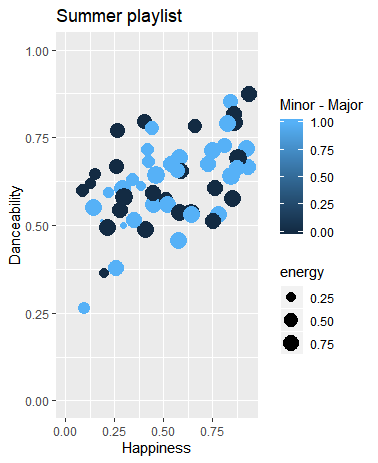
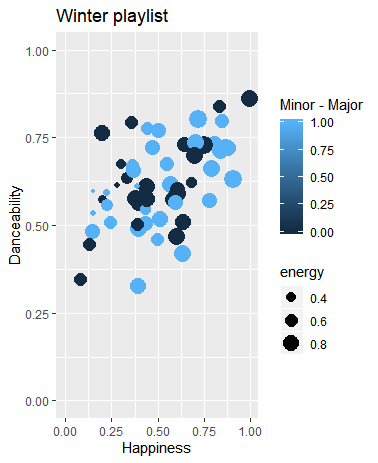

```{r setup, include=FALSE}
library(flexdashboard)
```

Column {data-width=550}
-----------------------------------------------------------------------

### Computational musicology

```{r}
print("# Computational Musicology 2020 ~ Britt Brilman

## Introduction
On this webpage I will build my data visualisations for the Computational Musicology course from 2020. The question I will be trying to answer is: -In what way do summer and winter top-chart playslists differ from oneanother?-. Personally I love listening to the summer hit-charts which will be filled with danceable, positive and energetic pop-songs, in contrast to the hit-charts in winter time, which I usually find incredibly tedious and annoying. I will compile top-40 charts from 5 consecutive weeks during high summer (June) and winter (Januari: to avoid christmas hits) to make two comparable playlists from 2013 with roughly 120 songs each. I have chosen the year 2013 after a quick scan at the charts: I recognize most of the songs from my highschool days when I listened to the popular songs the most. I would not know as many songs now as I did then, so by choosing the year 2013 for my research I have made it a lot more fun for myself. 

### Other idea's (will delete later if not necessary)
- (follow-up current idea) Try to find out if there is an increase in latin music in western culture
- (follow_up current idea) Generally try to find out if the difference in summer/winter tracks is something new or always present.
- (in case findings are not nice) try to find what is the characteristic trait of the typical summer song by comparing spotify's summer playslists to others. 
- Find out how big societal changes have an influence on hit-charts:  
  - watersnoodramp 1953; financial crisis 2007-08; 9/11.") 
```

Column {data-width=450}
-----------------------------------------------------------------------

### Tables

```{r}


```

### graphs

```{r}


```

